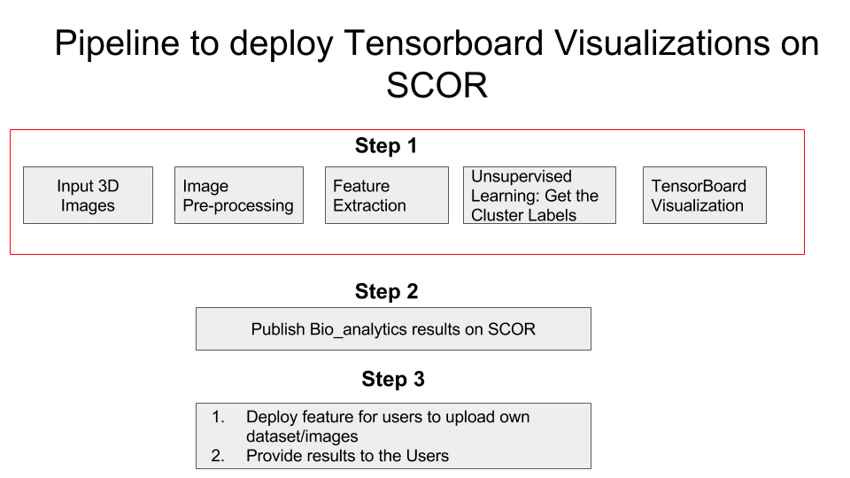

# Bio analytics

## Objective: 
1. Leverage TensorBoard dimensionality reduction visualizations to help evaluate and validate Unsupervised learning methods on 3D MRI image data. 

2. Deploy the finding on [Statistics Online Computational Resource (SOCR)](http://www.socr.umich.edu/),a portable online aids for probability, statistics and health science education, promotes technology-enhanced instruction, supports efficient statistical computing, and advances predictive big data analytics

## Pipeline

## Data: 
Confidential
